# Serverless CRUD API & Performance Benchmarking Lab

A production-ready guide to deploying, testing, and optimizing a decoupled serverless REST API backend on AWS. This project implements secure multi-action request routing using a single Python runtime handler and optimizes the resource profile using data-driven load testing.

---

## High-Level Architecture

The microservice leverages a completely serverless infrastructure pattern:

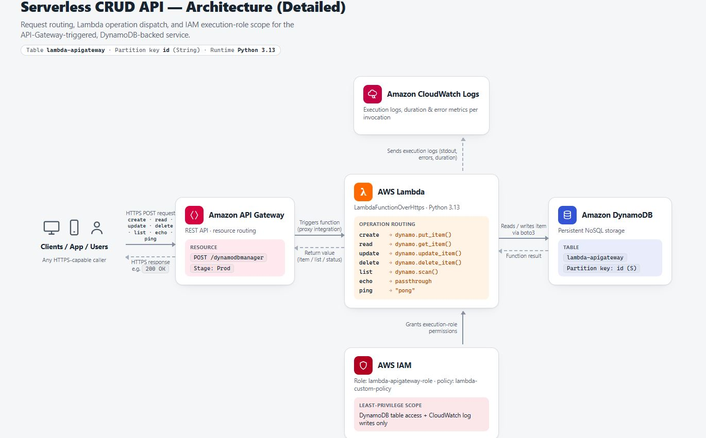

1. **Amazon API Gateway:** Directs HTTP payload endpoints securely via a custom resource `/dynamodbmanager`.
2. **AWS Lambda Execution Engine:** Runs an optimized Python 3.13 handler processing multiple operations without monolithic resource bloat.
3. **Amazon DynamoDB:** Stores non-relational table objects securely via partition key indexes.

---

## Step-by-Step Deployment Guide

### Step 1: Enforce Least-Privilege IAM Policies
1. Open the **Policies** page in the IAM Console and click **Create Policy**.
2. Select the JSON editor and paste the configuration located in `iam-policy.json`. This scopes Lambda capabilities down exclusively to required DynamoDB table mechanics and CloudWatch logging permissions.

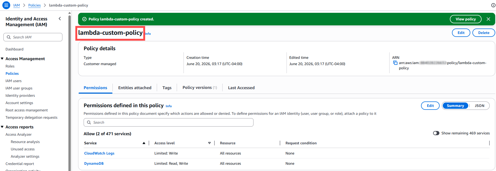

3. Name the policy `lambda-custom-policy`.
4. Go to **Roles > Create Role**. Choose **AWS Service** and select **Lambda** as the use case. Attach `lambda-custom-policy` and name the role `lambda-apigateway-role`.

### Step 2: Implement the Lambda Router
1. Provision an AWS Lambda function from scratch named `LambdaFunctionOverHttps` using **Python 3.13**. 

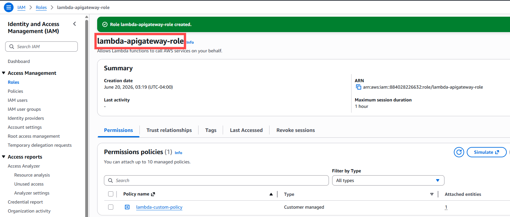

2. Under Permissions, change the default execution role to **Use an existing role** and select `lambda-apigateway-role`.
3. Swap out the boilerplate execution code with the routing block located in `lambda_function.py` and click **Deploy**.

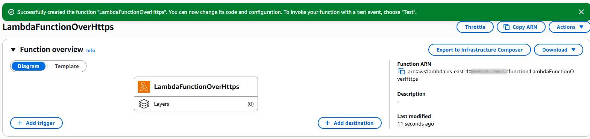

4. Run an execution test named `echotest` inside the console with an echo operation payload to confirm the runtime logic is sound.

### Step 3: Provision the DynamoDB Table
1. Open the **DynamoDB Console** and click **Create Table**.
2. Deploy a table named exactly `lambda-apigateway`. 

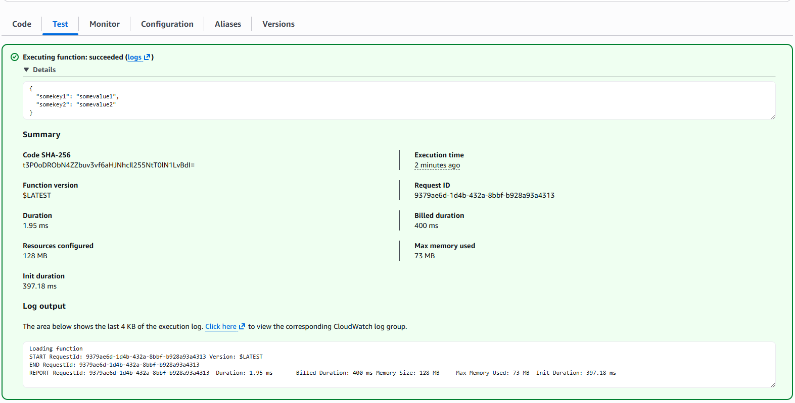

3. Specify your Partition Key as `id` with a data type of **String**. Leave everything else as default and create the table.

### Step 4: Configure API Gateway Routing
1. Inside the **API Gateway Console**, create a new **REST API** named `DynamoDBOperations`.
2. Click **Create Resource** and enter `DynamoDBManager` (Path: `/dynamodbmanager`).

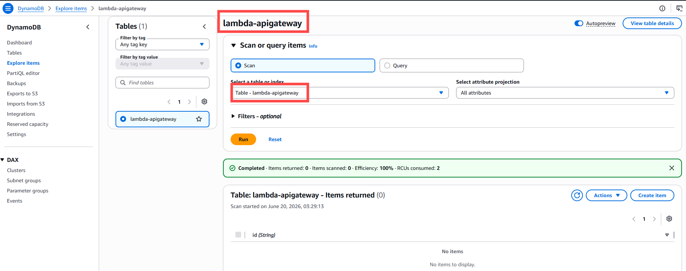

3. Select your new resource, click **Create Method**, choose **POST**, and select `LambdaFunctionOverHttps` as the integration backend function.
4. Click **Deploy API**, select `[New Stage]`, name it `Prod`, and copy your active **Invoke URL**.

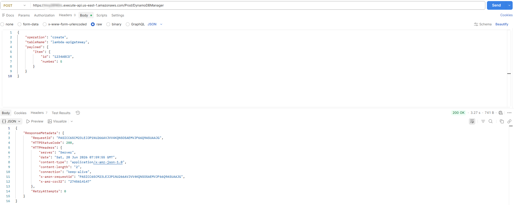

### Step 5: Functional Verification
1. Open Postman and pass a structured JSON payload over HTTPS to your live endpoint to trigger a database write operation. 

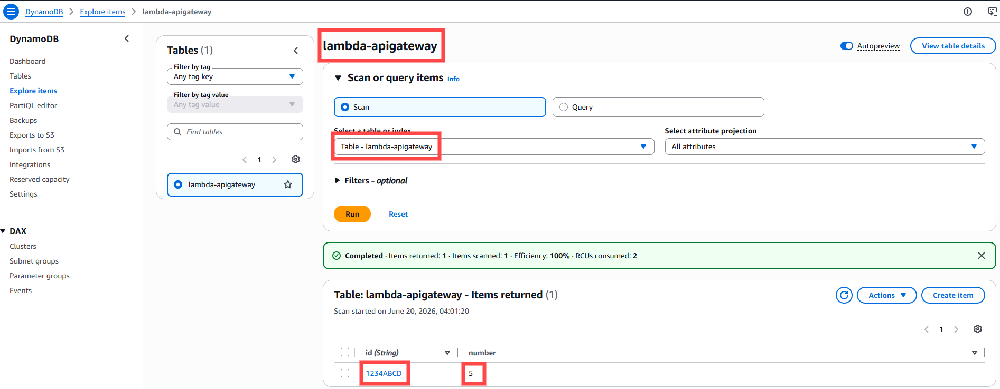

2. Head to the DynamoDB Console under **Explore table items** to visually validate that the record successfully wrote to the NoSQL database.

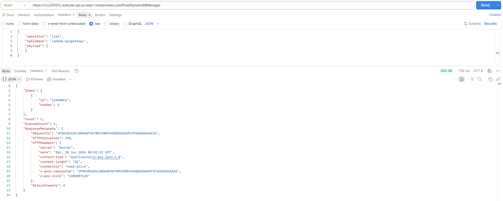

---

## Phase 5: Optimization & Microservice Load Testing

This module addresses the **Performance Efficiency** and **Cost Optimization** pillars of the AWS Well-Architected Framework.

### 1. AWS Lambda Power Tuning Configuration
Using the AWS Step Functions execution framework (`aws-lambda-power-tuning`), the system was systematically profiled using 10 concurrent requests across variable resource boundaries: `128MB, 256MB, 512MB, and 1024MB`. 

Input benchmarks can be reproduced utilizing the template provided inside `/test-payloads/lambda-power-tuning-input.json`.

#### Performance Optimization Walkthrough:
* **Step A:** Deploy the `aws-lambda-power-tuning` nested application from the Serverless Application Repository.
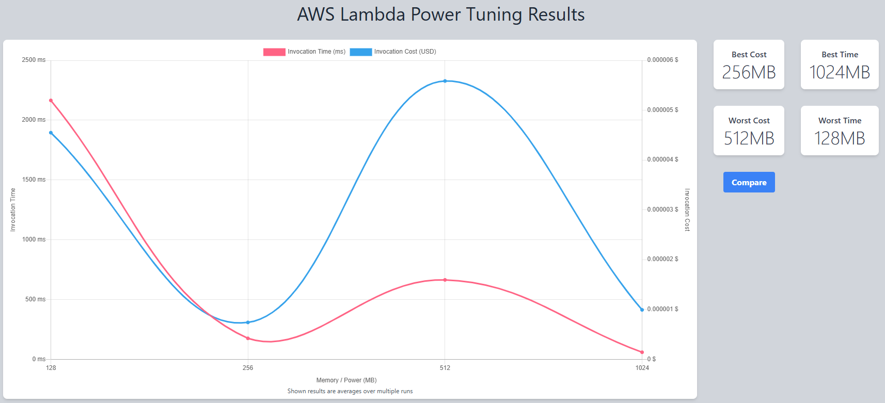

* **Step B:** Configure the input JSON tracking parameters inside the Step Functions dashboard execution screen.
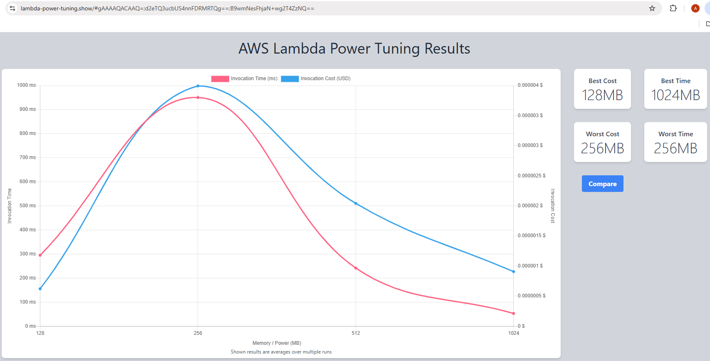

* **Step C:** Verify successful state machine branch execution runs.
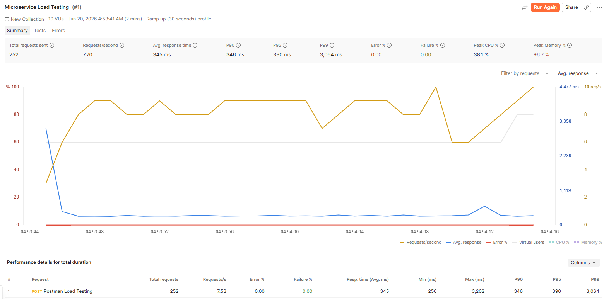

* **Step D:** Extract the unique visualization analytics URL link from the output execution log block.
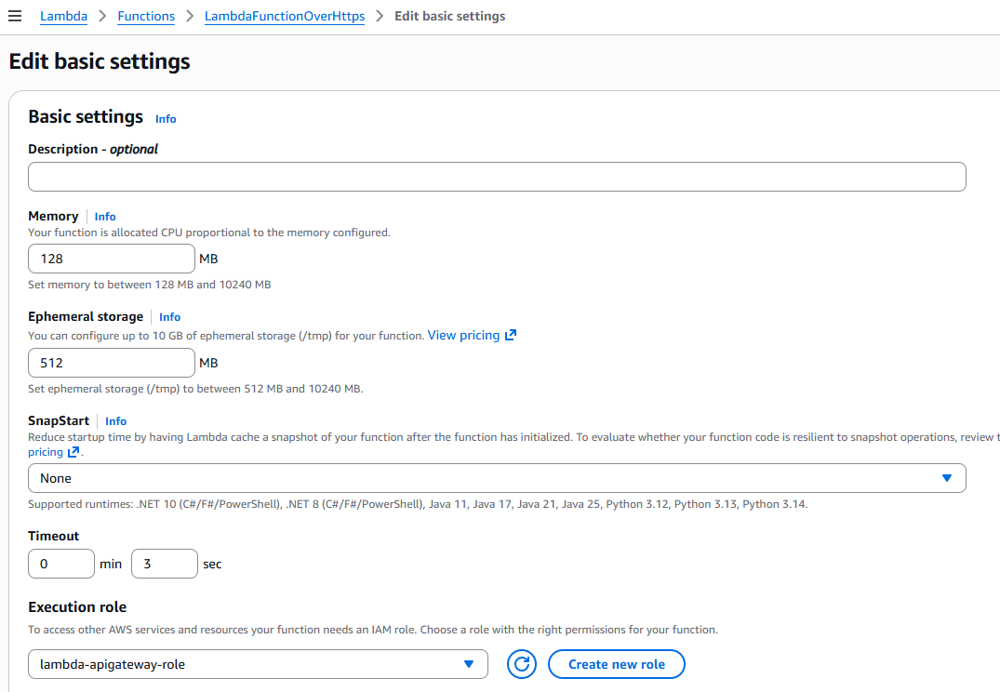

The resulting cost-performance trade-off visualization chart revealed the optimal resource inflection points:

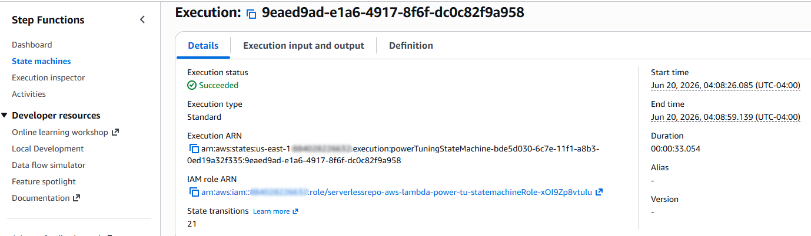

### 2. Postman Load Testing Validation
Real-world performance testing was captured over two primary deployment profiles to benchmark the vCPU resource scaling attributes of AWS Lambda:

#### Baseline Run (128MB Memory Allocation):
Under load, the backend encountered serialization processing boundaries. The average response times reflected a restricted CPU runtime footprint.
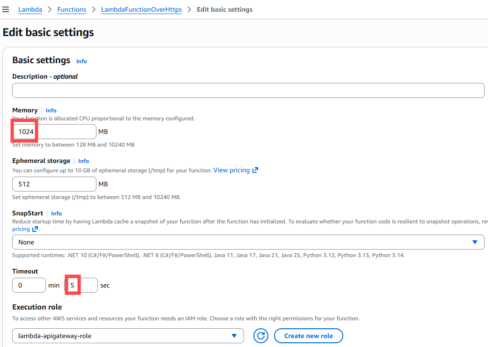

#### Adjusting Resource Configurations:
The Lambda general configuration was adjusted to **1024MB Memory** and given a extended **5.0-second execution timeout guardrail**.
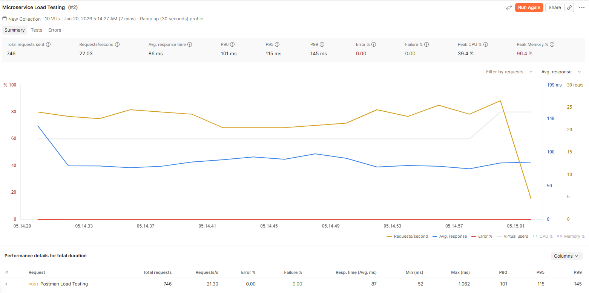

#### Optimized Run (1024MB Memory Allocation):
Average response times plummeted significantly. Because AWS allocates CPU shares linearly corresponding to your selected memory size, the function processed the JSON payloads and data streams exponentially faster.
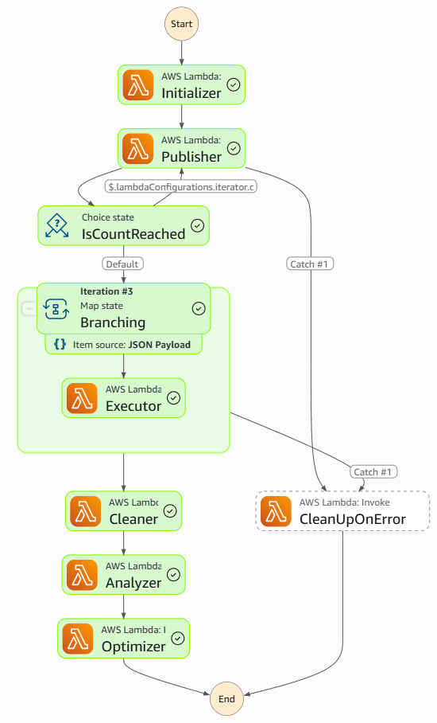

### Core Performance Optimization Logic
Because AWS scales available vCPU shares linearly alongside memory allocations, upgrading allocations to **1024MB** grants the underlying execution engine access to drastically faster compute pipelines. This reduces overall execution durations, allowing transaction costs to stay balanced while delivering massive performance gains.
